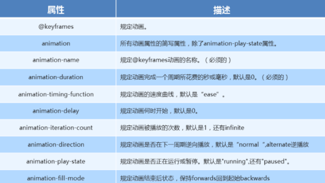

# CSS

## 特性

- **层叠性(就近原则)**  
- **继承性(子标签继承父标签)**  
  - 一般文字控制属性都会被继承，a标签颜色需单独设置,标题字体大小需单独设置
- **优先性(根据选择器权重 行内＞id＞类)**

## 权重

```
特等：!important  提高权重，有提权的效果，有了样式优先生效，权重是最大的；
第一等：行内样式，如: style=””，权值为1000       == 1,0,0,0
第二等：ID选择器，如：#content，权值为100        == 0,1,0,0
第三等：类，伪类和属性选择器，如.content，权值为10 == 0,0,1,0
第四等：标签选择器和伪元素选择器，如div p，权值为1  == 0,0,0,1
第五等，继承性的权重是0，通配符选择器的权重是0      == 0,0,0,0
注意：权重的叠加是没有进位的；
```

## 盒子模型

```css
div {
    box-sizing: border-box;
}
```


## ⭐flex

```css
   .box {
     /* 开启flex布局模式 */
     display: flex;
     /* 子元素是否换行 */
     flex-wrap: wrap;
     /* 设置主轴方向   默认row  y轴column*/
     flex-direction: column;
     /* flex-direction和flex-wrap的合写 */
     flex-flow: row wrap;
       
     /* 设置主轴子元素排列
     可选值center space-between 平分剩余空间space-evenly*/
     justify-content: center;
       
     /* 设置侧轴子元素排列(单行) */
     align-items: center;
       
     /* 设置侧轴子元素排列(多行) */
     align-content: flex-start;
   }
   .son {
     /* 数字表示当前子级盒子占有父级盒子的份数 */
     flex: 1;
     /* flex-grow、flex-shrink 和 flex-basis  放大/缩小/单独设置 */
   }
```


## 媒体查询

**媒体查询引入资源（了解）**

```html
<link rel="stylesheet" href="./css/style319.css" media="screen and (max-width:319px)">
```

```html
<style>
@media screen and (min-width: 750px) {

 html {
  font-size: 75px !important;
 }
    
}
</style>
```


## 伪类选择器

```css
 优先级LVHA
      /*让超链接点击之前是红色*/
      a:link {
        color: red;
      }
      /*让超链接点击之后是绿色*/
      a:visited {
        color: orange;
      }
      /*鼠标悬停，放到标签上的时候*/
      a:hover {
        color: green;
      }
      /*鼠标点击链接，但是不松手的时候*/
      a:active {
        color: black;
      }
      /*文本框获取焦点时  */
      input:focus {
        color: white;
      }
```


## 字体/背景/阴影复合写法

```css
div {
  /*注意:要按照顺序书写  没有的属性可以不写 文字大小和字体是必须要书写的
  复合写法:font：是否倾斜   是否加粗   文字大小/ 行高   字体； */
  font: italic 700 60px/60px "楷体";
    
  /*无书写顺序
  复合写法"background: 背景颜色 背景图片地址 背景平铺 背景图像是否滚动 背景图片位置（x y）; */
  background: #ccc url(./img/bg.jpg) no-repeat 6px center;
    
  /*默认scroll  如果想要不让跟随滚动条滚动就设置取值为fixed */
  background-attachment: fixed;
    
  /* 颜色半透明 只能让背景颜色透明，盒子里面的内容不受影响*/
  background-color: rgba(0, 0, 0, 0.5);
    
  /* 盒子半透明  包括背景和内容都透明 配合动画*/
  opacity: 0.5;
    
  /*默认外阴影  内阴影设置inset  阴影可以同时设置多层，每一层之间用英文的逗号隔开即可；
  box-shadow:水平阴影   垂直阴影   模糊距离   阴影大小   阴影颜色  内/ 外阴影；  */
  box-shadow: 5px 5px 10px #000, 20px 20px 10px red, 40px 40px 10px green;
    
  /* 凹凸效果：设置文字的颜色和背景一致，然后设置两层阴影，一个纯白，一个纯黑，水平和垂直的距离为1的正负取值；
  text-shadow:水平阴影   垂直阴影   模糊距离   阴影颜色 ；  */
  text-shadow: -1px -1px 0 #fff, 1px 1px 0 #000;
}
```


## 细线表格

```css
 table,
  th,
  td {
    border: 1px solid #0f0;
    /* 表格相邻描边合并为一条 */
    border-collapse: collapse;
  }
```


## 文本线条样式

```css
      .box {
        text-decoration: none;
        /* 下划线 */
        text-decoration: underline;
        /* 上划线 */
        text-decoration: overline;
        /* 删除线 */
        text-decoration: line-through;
      }  
```


## ⭐文本溢出省略号显示

- **单行文字溢出省略号显示**

```css
      .box {
        /* 折行文字一行显示 */
        white-space: nowrap;
        /* 溢出隐藏 */
        overflow: hidden;
        /* 隐藏文字以省略号显示 */
        text-overflow: ellipsis;
      }
```

- **多行文本溢出省略号显示**

```css
div {
  /* 将溢出的文字隐藏 */
  overflow: hidden;
  /* 溢出的文本省略号显示 */
  text-overflow: ellipsis;
  /* 让盒子伸缩模式显示 */
  display: -webkit-box;
  /* 规定限制在哪一行显示省略号 */
  -webkit-line-clamp: 2;
  /* 设置或者检索伸缩盒子队形里面的子元素排列方式 */
  -webkit-box-orient: vertical;
}
```

## 鼠标样式

```css
  div {
    /* 小手pointer  十字架move  文本text  禁止not-allowed*/
    cursor: pointer;
  }
```

## 取消表单轮廓线

```css
  /* 取消轮廓线 */
  input,
  textarea {
    outline: none;
  }
```


## 防止文本域被拖拽

```css
  /*防止文本域被拖拽  */
  textarea {
    resize: none;
  }
```

## ⭐after伪元素法清除浮动

```css
/* 清除浮动 */
.clearfix:after {
  content: ".";
  display: block;
  height: 0;
  visibility: hidden;
  clear: both;
}

.clearfix {
  zoom: 1; /* 兼容低版本浏览器 */
}
```


## 预处理器 scss和less

```
sass
和css编写规范有着很大的出入，是不使用花括号和分号的，所以不被广为接受。 Sass 是一款强化 CSS 的辅助工具，是对 CSS 的扩展，它在 CSS 语法的基础上增加了变量 (variables)、嵌套 (nested rules)、混合 (mixins)、继承(extend)、导入 (inline imports) 等高级功能

3.0更新后改名为scss
其语法完全兼容 CSS3，并且继承了 Sass 的强大功能。


声明变量 scss=>$  less=>@   

嵌套消除空格 &
```


## 灰色设置/图片模糊处理

```css
  /* 网站灰色设置 */
  html {
    filter: grayscale(100%);
  }
  /* blur模糊处理  数值越大越模糊 */
  img {
    filter: blur(10px);
  }
  img:hover {
    filter: blur(0);
  }
```


## 2D转换/3D转换/动画(⭐)

```css
   /* 2D转换 */
   div {
     /*透视 给被观察元素的父级盒子添加透视属性 */
     perspective: 500px;
     /* 3D呈现 给父级盒子才能让子级盒子展示3D立体空间 */
     transform-style: preserve-3d;
     /* 平移 */
     transform: translate();
     /* 缩放 */
     transform: scale();
     /* 旋转 deg单位 */
     transform: rotate();
     /* 转换中心点 */
     transform-origin: center;
     /* 过渡动画
     transition: 要过渡的属性  花费时间  运动曲线  何时开始;   */
     transition: all 1s linear 1s;
     /*自定义动画注意点:动画名称和动画持续时间必须要书写,动画延时必须书写单位s,持续时间和延时的时间有先后顺序,多个动画同时调用用逗号隔开
     复合写法 animation: 动画名称 持续时间 运动曲线 何时开始（延时） 播放次数 是否反向播放 动画结束后的状态 */
     /*暂停动画 此属性不能简写  默认running*/
     animation-play-state: paused;
   }

   @keyframes move {
     0% {
     }
     100% {
       transform: translateX(1000px);
     }
   }
```



## C3新增:结构伪类选择器/伪元素/属性选择器

```css
      /* CSS3新增结构伪类选择器 n可以是数字 关键字和公式 even偶数 odd奇数*/
      .box:nth-child(n) {
        color: #000;
      }
      .box:nth-of-type(n) {
        color: #000;
      }
	  /*css3新增伪元素 注意事项
      01、before 和 after 必须有 content 属性，哪怕空的也要写一个空的英文引号''； 
      02、伪元素只能加给双标签，input是不能直接设置伪元素的；
      03、伪元素的显示模式为行内元素,； */
 	  div::after {
  	    content: "";
  	    width: 10px;
        height: 10px;
 	  }
	  /*属性选择器*/
	  input[type=text] {
   		background-color: red;
      }
```

