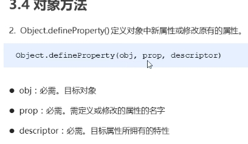
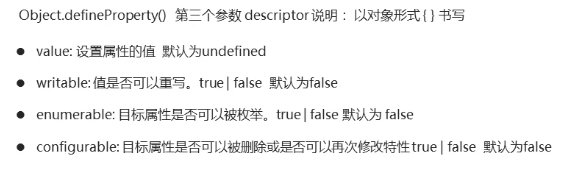

# JS

ESMA 6.0 2015/6之后每年6月发布一次

## 预解析

```
 预解析时如果遇到重复的变量声明，那么忽略。
 预解析时如果遇到重复的函数声明，保留后面的函数。
 预解析时如果遇到变量与函数重名的情况，保留函数。
```

## **变量命名规范**

```
1.不能以数字开头或则纯数字；
2.严格区分大小写；
3.不能使用关键字、保留字  ---  比如：var、for、if、while等
4.遵循驼峰命名法，首字母小写，后面单词的首字母需要大写；
5.特殊符号命名只允许 $ 和 _（底杠）符号
6.不要使用name命名，因为name是指向window对象的
```

## 同步任务和异步任务的执行过程⭐

```
同步任务都在主线程上执行，形成一个执行线；

异步任务是通过回调函数实现的；一般异步任务有以下三种类型：

01、普通事件，如click、resize等；

02、资源加载，如load，error等；

03、定时器，包括setTimeout、setINterval等；

异步任务相关回调函数添加到任务队列中（任务队列也成为消息队列）。

**同步和异步任务执行的原理：**

1、先执行：执行栈中的同步任务；

2、异步任务（回调函数）放到任务队列中。

3、一旦执行栈中的所有同步任务执行完毕，系统就会按次序读取任务队列中的异步任务，于是被读取的异步任务结束等待状态，进入执行栈，开始执行；
```


## 事件循环 event loop⭐

```
由于主线程不断的重复获得任务、执行任务、在获取任务、再执行任务。所以这种机制被称为事件循环；

01、代码执行的时候在“执行栈” 代码一次执行遇到同步执行的直接执行；

02、遇到了异步的回调函数，就直接交给“异步进程处理”，到任务列表（如果有些回调函数需要用户操作就会等待用户操作的结果到任务列表，如果用户没有操作则不作任何操作） ---  但是不会执行；

03、返回到“执行栈”继续执行代码（如果是同步就直接执行，如果是异步就“进程处理” ----  任务列表；

04、如果所有的执行栈里面的代码执行完了，再去执行任务列队中的代码循环到执行栈执行；
```


## 循环语句

```
#  continue关键字  退出本次循环  
#  break关键字     退出所有循环
```

- **do while**

```js
      //  do while循环
      var i = 0;
      do {
        // 循环体代码
        计数器更新;
      } while (条件表达式); //不满足条件会退出循环

```


## class类

```js
 // 1. 创建类 class  创建一个类
class Star {
    // 类的共有属性放到 constructor 里面 constructor是 构造器或者构造函数
    constructor(uname, age) {
      this.uname = uname;
      this.age = age;
    }
    sing(song) {
      console.log(this.uname + '唱' + song);
    }
}
// 2. 利用类创建对象 new
var ldh = new Star('刘德华', 18);
console.log(ldh); // Star {uname: "刘德华", age: 18}
ldh.sing('冰雨'); // 刘德华唱冰雨
```

## Object.defineProperty()



 

```js
新增或修改对象属性 Object.defineProperty()

 const obj = {
     name: '黑马',
     age: '18'
 }
 //新增或修改对象属性
 Object.defineProperty(obj, 'name', {
     //修改obj对象name属性的值
     value: '程序员',
     //不允许被修改
     writable: false,
     //不允许被遍历
     enumerable: false,
     //不允许被删除  修改特性
     configurable: false
 })
 //遍历不了
 const num = Object.keys(obj)
 //删不掉
 delete obj.name

// 数据变化 同步到视图
 const obj = {
     name: '黑马',
     age: '18',
     chirdren:{
         name1:'xx',
         age1:'1'
     }
 }
 function setView (){
     div.innerText = obj.name
     div1.innerText = obj.age
 }
 let name = obj.name
  Object.defineProperty(obj, 'name', {
 	get (){
      return name
    },
    set(val){
      name = val
      setView ()
    }
 })


## 新增对象属性不会触发defineProperty.set回调
## 对象属性如果是数组 通过下标修改可以触发set  push..等等方法不触发

vue禁用了下标修改  重写了数组的七个方法 来完成触发set回调完成了数据响应式

```


### Array对象方法 

```javascript
join()           数组转字符串。通过指定的分隔符进行分隔。
push()           向数组的末尾添加一个或更多元素，并返回新的长度。
unshift()        向数组的开头添加一个或更多元素，并返回新的长度。
pop()            删除并返回数组的最后一个元素
shift()          删除并返回数组的第一个元素
concat()         连接两个或更多的数组，并返回结果。
slice(n,m)       从索引 n 截取到索引 m 但不包括 m
sort((a,b)=>a-b) 从小到大排序
reverse()        颠倒数组中元素的顺序。 
⭐
splice（index,0,item1,item2,...)     从索引 index 开始增加，增加的内容插入到索引 index 前面
splice(index, n)                     从索引 index 开始删除n个，如果只有一个参数splice（index），就是从索引index开始后面的内容全部删除
splice（index,n,item1,item2,...)     从索引 index开始替换 n 个，替换的内容为item1,item2 ...
includes()                           判断某个数组是否包含给定的值，返回布尔值
//注意:concat() ,slice()不会改变原数组 ,slice(),splice(),concat()不传参数可以实现数组的克隆

# 参数是一个函数 函数的参数(item,index,arr) 分别对应数组成员,索引,原数组
forEach()     //遍历数组  

filter()      //遍历数组   筛选数组里满足条件的元素 返回一个新数组

some()        //遍历数组   满足条件就停止遍历      返回布尔值

find()        //遍历数组   返回第一个满足条件的成员 或 undefined 

map()         //返回处理后的新数组  数组中成员为引用类型时 直接修改会改变原数组

findIndex()   //用于找出第一个符合条件的数组成员的索引，如果没有找到返回-1

indexOf() // findIndex()的应用场景要比indexOf广泛一些，可以查找大于等于小于，表达式可以随便写，indexOf就只能在第一层查找相等的值。

every()       //遍历数组   查找数组里有没有不符合条件的成员 , 有则返回false

reduce()      // 累加器  reduce(arr,fn,[]) 

fill()        // 填充数组  

Array.from()  // from(obj,(item,index)=>{})
 
for...of 
`概念` : 遍历所有数据结构的统一的方法。
`使用范围` : 循环可以使用的范围包括数组、Set 、 Map 结构、某些类似数组的对象（比如 arguments 对象、DOM NodeList对象）、Generator 对象，以及字符串。
`注意` : for of 不能对象用 可以进行break终止，不可以return

for in：一般用来遍历对象，并且可以遍历原型对象


// 可以应用于合并数组
 ary1.push(...ary2);

可以应用于伪数组转换为真正的数组
let oDivs = document.getElementsByTagName('div'); 
oDivs = [...oDivs];

// 定义一个集合
let arrayLike = {
    '0': 'a',
    '1': 'b',
    '2': 'c',
    length: 3
}; 
// 转成数组
let arr2 = Array.from(arrayLike); // ['a', 'b', 'c']
// 创建一个 1-100的数组
Array.from({length:100}, (v,k) => k+1)
Array.from(Array(100), (v,k) =>k+1)

 let arrayLike = { 
     "0": 1,
     "1": 2,
     "length": 2
 }
 let newAry = Array.from(arrayLike, (item,index) => item *2)//[2,4]
```


### Date对象方法

```js
var myDate = new Date()
Date()	       返回当日的日期和时间。
getDate()	   从 Date 对象返回一个月中的某一天 (1 ~ 31)。
getDay()	   从 Date 对象返回一周中的某一天 (0 ~ 6)。
getMonth()	   从 Date 对象返回月份 (0 ~ 11)。
getFullYear()  从 Date 对象以四位数字返回年份。
getHours()	   返回 Date 对象的小时 (0 ~ 23)。
getMinutes()   返回 Date 对象的分钟 (0 ~ 59)。
getSeconds()   返回 Date 对象的秒数 (0 ~ 59)。
getMilliseconds()返回 Date 对象的毫秒(0 ~ 999)。
getTime()	   返回 1970 年 1 月 1 日至今的毫秒数。

```


### Number对象方法

```
toFixed(n)	 把数字转换为小数点后有n位数字的字符串。 
```


### String 对象方法

```js
split()	      把字符串分割为字符串数组。
charAt()	      返回在指定位置的字符。
indexOf()	      检索字符串   找不到返回-1
replace()        替换一个与正则表达式匹配的子串。
slice(start, end)	  截取start~end(start,end为字符串的下标,可以为负值)之间的字符串所有字符(不包含end)
substr(start,length) 根据长度截取字符串,如果省略第二个参数，将裁剪字符串的剩余部分
lastIndexOf()        从后向前搜索字符串  找不到返回-1
concat()	         连接字符串。
match()	             找到一个或多个正则表达式的匹配。
search()	         检索与正则表达式相匹配的值。  没有找到匹配返回-1
substring(start, end)提取字符串中两个指定的索引号之间的字符。
toLowerCase()	     把字符串转换为小写。
toUpperCase()	     把字符串转换为大写。
charCodeAt()         返回在指定的位置的字符的 Unicode 编码。  返回值是0-65535之间的整数
String.fromCharCode()  ascii码砖字符
//大写字母A 到Z 的值是从65 到90;
//小写a到z 是从91 到 122;

#es6新增
includes()           判断是否包含给定的值，返回布尔值
startsWith()         表示参数字符串是否在原字符串的头部，返回布尔值
endsWith()           表示参数字符串是否在原字符串的尾部，返回布尔值
repeat()             repeat方法表示将原字符串重复n次，返回一个新字符串


padStart(2,"0")  不足2位  第一位用0补位
padEnd(2,"0") 不足2位  用0补位

encodeURI  转码
decodeURI  解码
```


### **Object 对象方法**

```js
// 返回值是一个数组 数组成员是当前对象中的属性名  
Object.keys(对象)            

// 
Object.defineProperty(对象，修改或新增的属性名，{
		value:修改或新增的属性的值,
		writable:true/false,//如果值为false 不允许修改这个属性值
		enumerable: false,  //enumerable 如果值为false 则不允许遍历
    configurable: false //configurable 如果为false 则不允许删除这个属性 属性是否可以被删除或是否可以再次修改特性
})	

// 将所有属性的值从一个或多个源对象分配到目标对象。它将返回目标对象。
Object.assign(targetObject, sourceObject)  

const target = { a: 1, b: 2 };
const source = { b: 4, c: 5 };

const returnedTarget = Object.assign(target, source);

console.log(target); //  Object { a: 1, b: 4, c: 5 }

console.log(returnedTarget);//  Object { a: 1, b: 4, c: 5 }


// getOwnPropertyDescriptor  返回一个对象 对象含有属性的描述信息
 const obj = {
     name: '黑马',
     age: '18'
 }
 
 Object.getOwnPropertyDescriptor(obj,'name')  // 返回一个对象 对象含有属性的描述信息

//可以创建一个没有原型的对象
Object.create(null)         

## 如何判断一个对象为空对象

+ JSON.stringify(obj) === '{}'
+ Object.keys(obj).length === 0
```


### Set 数据结构

 Set是es6新增的数据结构，类似于数组，区别在于不包含重复的值 拥有forEach方法

```js
const nameArr = new Set(['张三', '李四', '张三', '王麻子'])
// Set(3) {"张三", "李四", "王麻子"}
```

**add**

```js
// 添加元素
const nameArr = new Set(['张三', '李四', '张三', '王麻子'])
nameArr.add('赵六') // Set(4) {"张三", "李四", "王麻子", "赵六"}
```

**delete**

```js
// 删除元素
const nameArr = new Set(['张三', '李四', '张三', '王麻子'])
nameArr.delete('张三') // // Set(2) {"李四", "王麻子"}
```

**clear**

```js
// 清楚所有
const nameArr = new Set(['张三', '李四', '张三', '王麻子'])
nameArr.clear() // Set(0) {}
```

**has**

```js
// 监测    表示 set 结构中是否有张三 返回布尔值
const nameArr = new Set(['张三', '李四', '张三', '王麻子'])
nameArr.has('张三') // true
```

**实战应用**

```js
// 数组去重
const name = ['张三', '李四', '王五', '赵六', '张三']
const name2 = new Set(name) // Set(4) {"张三", "李四", "王五", "赵六"}
```

```js
// 数组交集
const name = ['张三', '李四', '王五', '赵六']
const name2 = ['张三', '李四', '王五', '王麻子']
const name3 = name.filter(item => {
  return new Set(name2).has(item)
})
// (3) ["张三", "李四", "王五"]
```

```js
// 数组并集
const name = ['张三', '李四', '王五', '赵六']
const name2 = ['张三', '李四', '王五', '王麻子']
const name3 = new Set([...name, ...name2])
//Set(5) {"张三", "李四", "王五", "赵六", "王麻子"}
```

```js
// 数组差集
const name = ['张三', '李四', '王五', '赵六', '王麻子']
const name2 = ['张三', '李四', '王五']
const name3 = name.filter(item => {
  return !new Set(name2).has(item)
})
// (2) ["赵六", "王麻子"]
```


### RegExp(正则表达式)对象 

- **修饰符**

  ```
  i	执行对大小写不敏感的匹配。
  g	执行全局匹配（查找所有匹配而非在找到第一个匹配后停止）。
  m	执行多行匹配。
  ```

  

- **RegExp对象方法**

  ```js
  compile()	//编译正则表达式。	
  ⭐exec()    //检索字符串中指定的值。返回找到的值，并确定其位置。 未找到匹配，则返回值为 null
  ⭐test()	   //检索字符串中指定的值。返回 true 或 false。
  //提示:支持正则表达式的 String 对象的方法search(),match(),replace(),split()
  
  
  // this.searchText为变量   用于动态匹配
  const reg = new RegExp(this.searchText, 'gi')
  
  ```

  

### Symbol

```js
const a = Symbol('level')
const b = Symbol('level')

const student = {
	name:'小明',
  age:18,
  [a]:'优秀',
  [b]:'有钱'
}

// 获取对象Symbol类型的属性
let list = Object.getOwnPropertySymbols(student) // 打印 [Symbol('level'),Symbol('level')]
for(key of list){
  console.log(key)  // 打印两次Symbol('level')
  console.log(list[key]) // 打印优秀  有钱
}

// Symbol.iterator是一个内置的值  如果对象有Symbol.iterator这个属性 则该对象可以被for..of遍历
const list = [1,2,3,4]

```


### Math对象方法

```
abs(x)	    返回数的绝对值。
ceil(x)	    向上取整。
floor(x)	向下取整。
max(x,y)	返回 x 和 y 中的最大值。
min(x,y)	返回 x 和 y 中的最小值。
random()	返回 0 ~ 1 之间的随机数。
round(x)	把数四舍五入为最接近的整数。

function getRandom(min, max) {
       return Math.floor(Math.random() * (max - min + 1)) + min;
  }
```


### Global对象 ()

```
全局属性和函数，可用于所有内建的JavaScript对象
isNaN()　　　　　　判断一个值是否是NaN  
parseInt()　　　  解析一个字符串并返回一个整数    或者  1.1 | 0  // 取整 cosole.log(1)
parseFloat()　　  解析一个字符串并返回一个浮点数 
```


# 类型检测

**1. typeof(变量)  或  typeof 变量**

```js
     
`概念` : 用来检测数据类型的运算符  返回值是字符串格式。能够返回的数据类型有6种

“number”,“string”,“bolean”,“undefined”,“function”,“object”。

`缺点` : 不适用数组,正则,null,不能处理 构造函数创建的原始类型  如: new String('abc')  // "object"

// typeof(NAN)和typeof(Infinity) 返回的是 number
```

  **2. 变量 instanceof 类型**

```js
 
`概念` : 检测一个实例是否属于某个类

`缺点` : 

var a= new Array();a instanceof Array; 会返回 true，同时 a instanceof Object 也会返回 true;

// arr instanceof Array   返回布尔值
```

**3. Object.prototype.toString.call()**

```js
// 最全面也是最常用的检测数据类型的方式。

Object.prototype.toString.call()　　原型链上的Object对象的toString方法


返回值 [object 数据类型]
```

**ES6新增检测数组**

```js
Array.isArray(arr)  // 返回布尔值
```


# 常用验证规则

## 验证规则

```
 邮箱
 const regEmail = /^\w+@\w+(\.\w+)+$/
 手机号
 const regMobile = /^1[34578]\d{9}$/
```


# lodash

```
数组 
differenceBy   数组排除


函数
throttle  节流
debounce   防抖


对象
merge   对象合并   

数字
random   随机数

语言
cloneDeep  深拷贝
```

