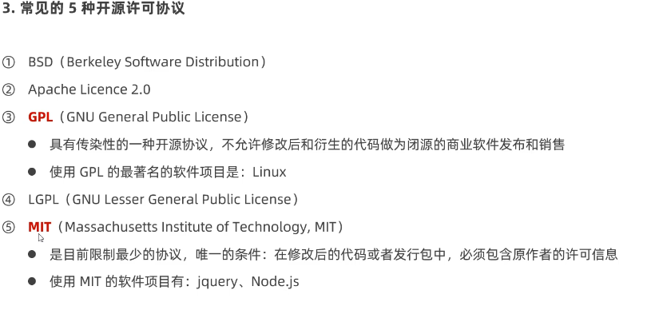
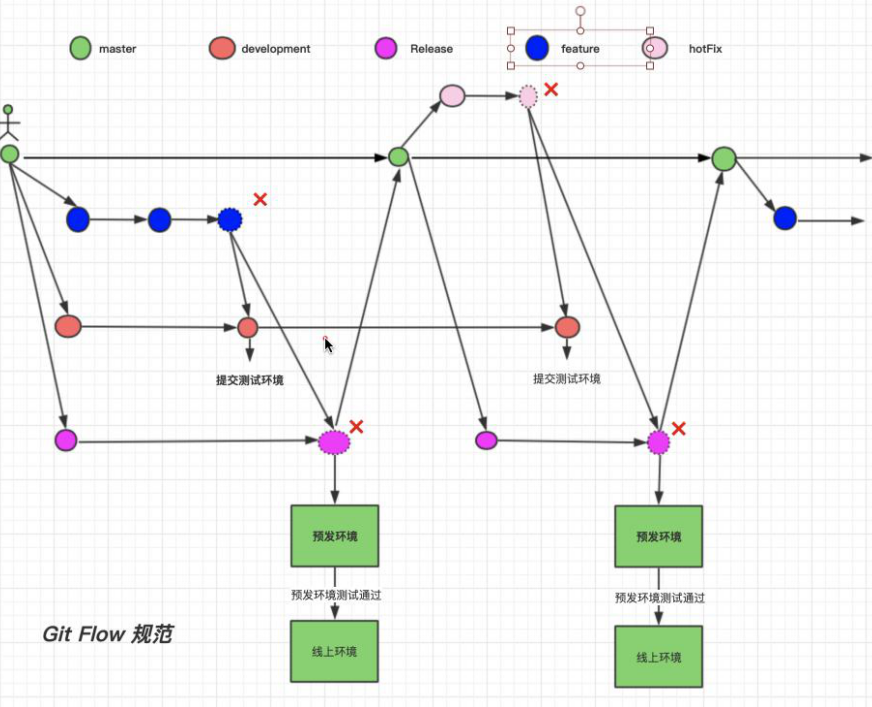

# git

Git的三种状态 :已修改 已暂存 已提交 相对应 工作区 暂存区 git仓库
工作区文件的四种状态:未跟踪 未修改 已修改 已暂存

# 常用命令

```react

git status -s              //检查仓库内文件的状态  未跟踪 ??   已暂存A   已修改M
git add .                  //向暂存区添加文件
git commit -m "描述消息"     //将暂存区文件放入git仓库
// 
git branch                   //查看当前Git仓库中所有的分支列表
git branch 分支名称           //在当前分支中创建新分支 (只创建,不切换分支) 
git checkout 分支名称         //切换分支
git checkout -b 分支名称      //创建并切换到此分支
git merge 分支名              //(先切换到主分支git checkout master在执行)合并分支
// 
git clone 远程仓库的地址 文件夹           //文件下载到本地 文件会自动创建
git push -u origin 分支名              //本地分支推送到远程仓库 第一次推送需要加-u 分支名
git pull origin 分支名                 //从远程仓库,拉取当前分支最近代码

git remote -v                         //查看关联远程仓库地址
git remote add origin 远程仓库地址      //本地仓库和远程仓库关联  
git remote rm origin                 //删除远程仓库(解除关联)
// 回退版本
git log --pretty=oneline                            //展示提交历史
git reset --hard 提交ID                              //转到提交ID的版本
git reflog --pretty=format:"%h | %an | %ar | %s"  //查看所有提交记录
git log -5 --pretty=format:"%h | %an | %ar | %s"  //一行展示最近提交的历史信息 格式为:哈希值丨作者名字丨修订日期丨提交说明
```


## 本地仓库git命令

```js
git help config                          //打开 git config 命令的帮助手册
git config -h                            //想要获取 git config 命令的快速参考
git --version                            //查看git版本
git config --global user.name "itheima"             //配置姓名
git config --global user.email "itheima@itcast.cn"  //配置邮箱

git config --list --global                 //查看所有的全局配置项
git config user.name                       //查看指定的全局配置项
git config user.email                      //查看指定的全局配置项

cd 绝对路径                         //转到当前文件夹
git init                          //将当前的目录转化为 `Git` 仓库
git status -s                     //检查仓库内文件的状态  未跟踪 ??   已暂存A   已修改M
git add .                                 //向暂存区添加文件
git commit -m "描述消息"                   //将暂存区文件放入git仓库
git commit -a -m "描述消息"                //跳过暂存区放入git仓库

git log -5 --pretty=oneline              //一行展示最近提交的历史信息
git log -5 --pretty=format:"%h | %an | %ar | %s"  //一行展示最近提交的历史信息 格式为:哈希值丨作者名字丨修订日期丨提交说明
```

## 分支操作命令

```js
git branch                       //查看当前Git仓库中所有的分支列表
git branch 分支名称               //在当前分支中创建新分支 (只创建,不切换分支) 
git checkout 分支名称             //切换分支
git checkout -b 分支名称          //创建并切换到此分支
git merge 分支名                 //(先切换到主分支git checkout master在执行)合并分支
git branch -d 分支名             //删除分支(需要在其他分支执行)
##冲突时的分支合并:不同分支对同一文件进行了不同的修改 
##此时需要手动解决冲突的文件,解决后执行git add . 在git commit -m
```


## 生成SSH key

```js
1.ssh-keygen -t rsa -C "your_email@example.com" //连续三次回车在C盘用户文件夹.ssh目录中生成两个文件, 复制id_rea.pub内容到公钥里   
2.ssh -T git@gitee.com                             //检测是否配置成功
3.git remote add origin 远程仓库地址                 //本地仓库和远程仓库关联          
4.git push -u origin master                        //第一次提交到远程仓库    
5.git remote -v                                    //查看远程仓库地址
6.git remote rm origin                             //解除关联(删除远程仓库)
```

## 远程仓库git命令

```js
git clone 远程仓库的地址                        //文件下载到本地
git clone 远程仓库的地址 文件夹                  //文件下载到本地 文件会自动创建
git push -u 远程仓库的别名 本地分支名称:远程分支名称 //本地分支推送到远程仓库
git push -u origin 分支名                     //本地分支推送到远程仓库 第一次需要加-u 分支名
git remote show 远程仓库名称                   //查看远程仓库所有分支列表信息
git remote                                  //查看关联远程仓库别名
git remote -v                               //查看关联远程仓库地址

git checkout 远程分支名称                      //从远程仓库对应远程分支下载到本地仓库
git checkout -b 本地分支名称 远程仓库名称/远程分支名称 //从远程仓库对应远程分支下载到本地仓库(并对本地分支重命名)

git pull                                    //从远程仓库,拉取当前分支最近代码
git push origin --delete 分支名              //删除远程仓库分支
git remote rm origin                       //删除远程仓库
```


## 撤销操作

```javascript
git checkout -- 文件名                         //对工作区的文件撤销对文件的修改  还原成git仓库里的版本    !!危险操作!!
git reset HEAD .   git reset HEAD 要移除的文件名称//从暂存区移除文件
git rm -f 文件名                                //删除git仓库的文件，并且不保存本地工作区(仓库里的文件这时候还没有删除，下次commit才会真正删除)
git rm --cached 文件名                         //删除git仓库文件，并且文件保存在工作区
```


## 回退到指定的版本

```javascript
git log --pretty=oneline                            //展示提交历史
git reset --hard 提交ID                              //转到提交ID的版本
git reflog --pretty=format:"%h | %an | %ar | %s"      //查看所有提交记录
```


## 忽略文件  

1在本地仓库文件夹创建名为 .gitigore的配置文件
2.直接写入文件名
3.文件夹/   (代表此文件夹中的所有文件)


文件 `.gitignore` 的格式规范如下： 
① 以 # 开头的是注释
② 以 / 结尾的是目录
③ 以 / 开头防止递归
④ 以 ! 开头表示取反
⑤ 可以使用 glob 模式进行文件和文件夹的匹配（glob 指简化了的正则表达式）
星号 * 匹配零个或多个任意字符
[abc] 匹配任何一个列在方括号中的字符（此案例匹配一个 a 或匹配一个 b 或匹配一个 c） 
问号 ?只匹配一个任意字符
两个星号 **表示匹配任意中间目录（比如 a/**/z 可以匹配 a/z 、 a/b/z 或 a/b/c/z 等）
在方括号中使用短划线分隔两个字符， 表示所有在这两个字符范围内的都可以匹配（比如 [0-9] 表示匹配所有 0 到 9 的数字）


## 开源许可协议 GPL  MIT



# Git Flow规范



