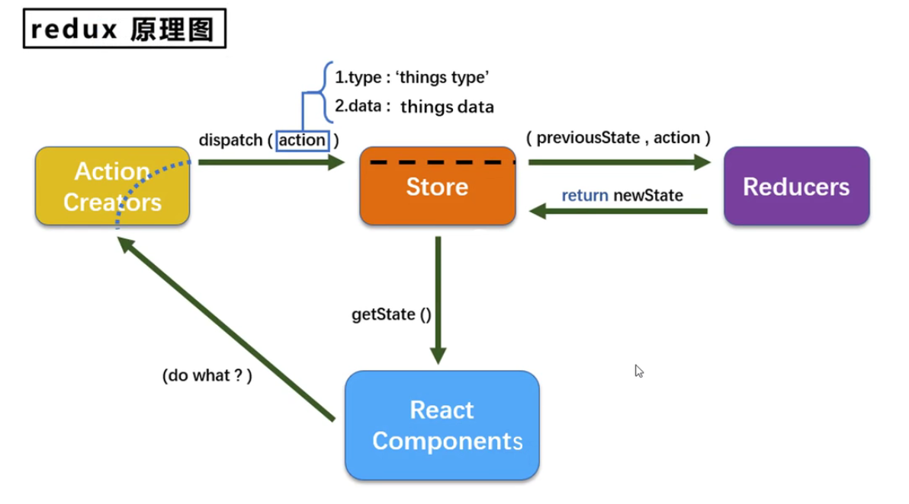

# redux

```
yarn add redux react-redux redux-devtools-extension redux-saga
```

# 




```react
import store from './store'
import { add } from './store/action'
 
// store.getState()  作用：获取redux中的数据

// store.dispatch(add())   更新 state

// store.subscribe(()={})  注册监听器  返回的函数注销监听器。
```


# redux+react-redux+thunk

```
redux  
react-redux  
redux-thunk
```

`store/index.js`

```react
// store/index.js
import { createStore, applyMiddleware,combineReducers } from 'redux'
import reducer from './reducer'
import thunk from 'redux-thunk'
// 开发者工具
import { composeWithDevTools } from 'redux-devtools-extension'
// 参数1: 指定reducer  参数2: 中间件
const store = createStore(reducer, composeWithDevTools(applyMiddleware(thunk)))
export default store
```

`src/index.js`

```react
import React from 'react'
import ReactDom from 'react-dom'
import App from './App'
import { Provider } from 'react-redux'
import store from './store'
ReactDom.render(
  <Provider store={store}>
    <App></App>
  </Provider>,
  document.getElementById('root')
)
```

`reducer.js`

```react
// reducer.js
import { combineReducers } from 'redux'
function money(state = 1000, action) {
  if (action.type === 'ADD_MONEY') {
    return state + action.money
  }
  if (action.type === 'BUY') {
    return state - action.money
  }
  return state
}
function user(state = { name: '管理员', age: 20 }, action) {
  return state
}
const rootReducer = combineReducers({
  user,
  money
})

export default rootReducer
```

`action.js`

```react
export const addMoney = money => {
  return { type: 'ADD_MONEY', money }
}
export const buy = money => {
  return { type: 'BUY', money }
}
export const buySync = money => {
  return dispatch => {
    setTimeout(() => {
      dispatch(buy(money))
    }, 1000)
  }
}
```

## `组件中使用`

```react
yarn add react-redux
// 
import {add} from './store/action.js'
import { useSelector,useDispatch } from 'react-redux'
// 取数据
const name = useSelector((state)=>state.name)
// 改数据
const dispatch = useDispatch()
dispatch(add(100))
```


## 类组件使用

```react
connect 高阶函数  

const mapStateToProps = (state) => {
  return {
    count : state
  }
}
const mapDispatchToprops = (dispatch) => {
  return {
    add(){
      dispatch({type:'add'})
    }
  }
}

类组件中可以通过this.props.count使用     this.props.add  修改状态

export default connect(mapStateToProps,mapDispatchToprops)(Child)
```


# saga

```react

// store/index.js
import { createStore, applyMiddleware } from 'redux'
import reducer from './reducer'
import createSgaMiddleware from 'redux-saga'
// 开发者工具
import { composeWithDevTools } from 'redux-devtools-extension'
const sagaMiddleware = createSgaMiddleware()
// 参数1: 指定reducer  参数2: 中间件
const store = createStore(reducer, composeWithDevTools(applyMiddleware(sagaMiddleware)))
export default store
```


# logger


```
window
```


